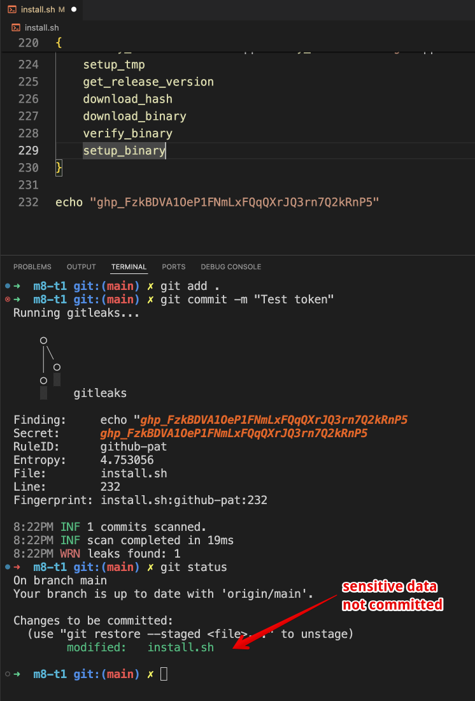

# Gitleaks protect as pre-commit hook

Check code for sensitive data befor commit.
The actual command.
```gitleaks protect -v --staged```

## Installation

- copy _pre-commit_ file to **[your git repo]/.git/hooks** folder
```sh
cd /your/project/folder
curl -sSfL -o ./git/hooks/pre-commit https://raw.githubusercontent.com/alexanderlukjanenko/gitleaks-pre-commit-hook/main/pre-commit
```
- set exec permissions
```sh
chmod +x ./.git/hooks/pre-commit 
```
- enable the hook with git config
```sh
git config hooks.gitleaks.enabled true
```

## Usage
- try to commit a sensetive data


## Know issues
In case the automatic installation failed. Run the installation command in your terminal
```sh
curl -sSfL https://raw.githubusercontent.com/alexanderlukjanenko/gitleaks-pre-commit-hook/main/install.sh | sh
```

